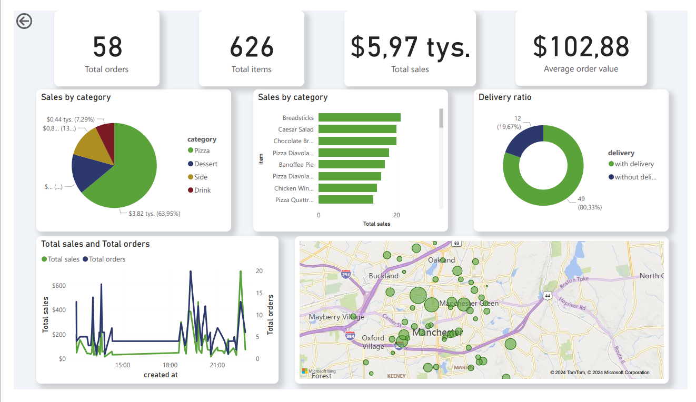
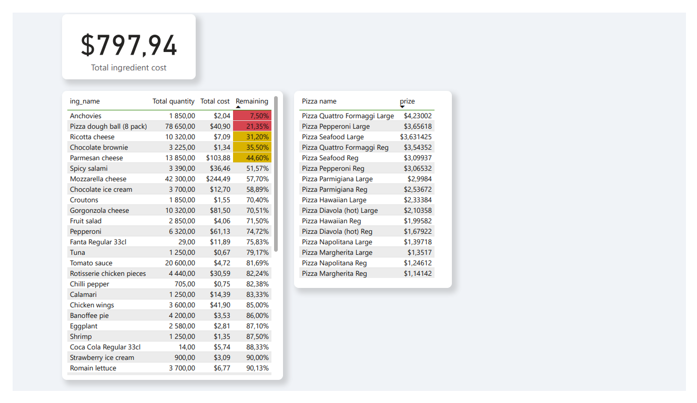
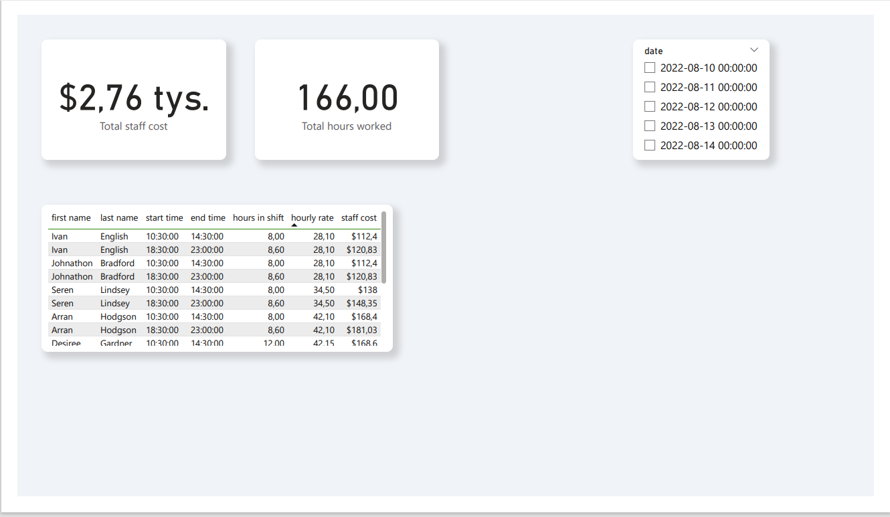

# Project-1: SQL & PowerBI Project

Welcome to my first data analytics project, where I explore the integration of SQL and Power BI to manage and visualize data for a pizzeria.

Project Overview
This project focuses on efficiently managing a pizzeria's operations by utilizing SQL for data management and Power BI for creating insightful visualizations. I started by purchasing relevant datasets, which I then uploaded in CSV format.

Key Steps:
Entity-Relationship Diagram (ERD):
To understand the relationships between various entities, I created an ERD. A PNG file of this diagram is included in the repository.

Data Management with SQL:
The CSV files were imported into SQL, where I structured and managed the data to form comprehensive datasets.

Dashboards in Power BI:
I created three key dashboards in Power BI, each serving a distinct purpose:

Sales Overview Dashboard:
Provides a summary of key sales metrics such as the total number of orders, total items sold, total revenue, best-selling categories, and delivery ratios.

Inventory Management Dashboard:
Tracks inventory usage, alerts for reorder points, and monitors product costs to ensure pricing accuracy.

Staff Management Dashboard:
Offers insights into staff work schedules, payroll costs, and overall staffing efficiency.
All of the dashboards can be found in pdf, PowerBi file, or down below in readme file.

Real-time Data Updates
By connecting SQL directly with Power BI, any updates or changes in the SQL datasets are automatically reflected in the Power BI visualizations, ensuring real-time data accuracy.

